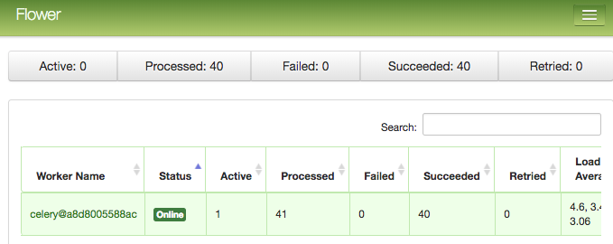

# Apache Airflow

[](https://travis-ci.org/pganzon/airflow)

This is a docker implementation of Apache Airflow a platform to programmatically author, schedule and monitor workflows. For more information about Apache Airflow please visit this [link](https://airflow.apache.org/).

Current Build Version: **`1.7.1.3`**

## Build

To build the image locally. From the root directory of this repo run:

```
make local
```

## Useage

### 1. SequentialExecutor

To run `Airflow` using `SequentialExecutor` run:

```
docker run --name=airflow -d  -p 8080:8080 paulganzon/airflow:latest
```

Visit [http://localhost:8080](http://localhost:8080) to access Airflow Web UI.

To teardown the container run:

```
docker rm -f airflow
```

### 2. CeleryExecutor

To run `Airflow` using `CeleryExecutor` run:

```
make up
```

This will run the following:
- `postgresql` as the backend db
- `rabbitmq` as the `Celery broker`
- `airflow-master` which is composed of `webserver`, `scheduler` and `flower`
- `airflow worker`

To teardown the containers run:

```
make down
```

Once all the containers above are running the following UIs are accessible:

|UI|URL|
|---|---|
|Airflow UI|http://localhost:8080|
|Flower - Celery Monitoring Tool |http://localhost:5555|
|RabbitMQ Management UI|http://localhost:15672|

[**Airflow UI**](http://localhost:8080)


[**Flower - Celery Monitoring Tool**](http://localhost:5555)



[**RabbitMQ Management UI**](http://localhost:15672)

